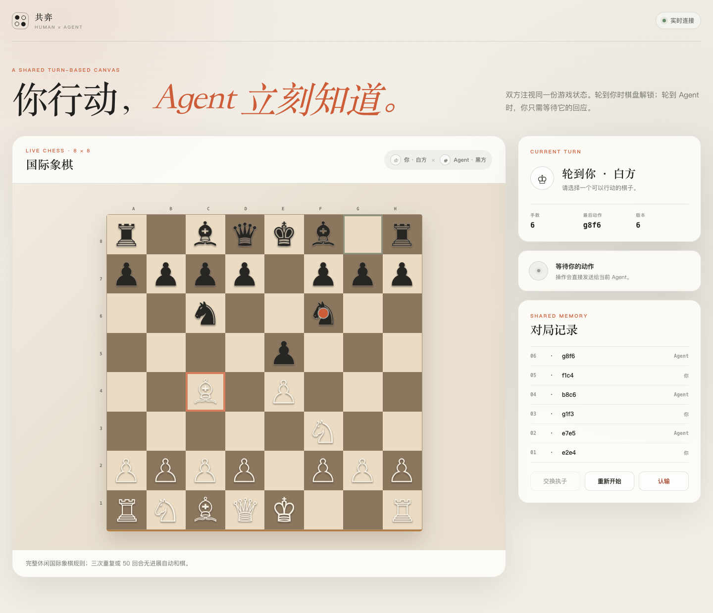

# Qipai Skill

一个让人类和 AI Agent 通过共享本地 HTML 界面实时对弈的实验性 Skill。

[](https://github.com/zenaszou/qipai_skill/actions/workflows/ci.yml)
[](LICENSE)



当前支持：

- 严格连珠（Renju / Gomoku / 五子棋）
- 国际象棋（Chess / 西洋棋）
- 中国象棋（Xiangqi / Chinese Chess）

人类在浏览器棋盘上操作，Agent 通过本地事件协议等待并提交动作。双方不需要在聊天中转述着法。

## 特点

- 无第三方运行依赖，仅需 Node.js 18+
- 服务默认只监听 `127.0.0.1`
- 服务端统一校验回合、revision 和合法动作
- 浏览器、人类、Agent 使用同一个权威局面
- 支持认输、交换阵营、重新开始和终局事件
- 包含三套规则引擎、协议测试和响应式 HTML 棋盘
- 为国际象棋和中国象棋提供按候选着法索引的一层对手威胁与安全提示
- 为未来隐藏信息游戏预留 `human`、`agent`、`public` 视图边界

> Agent 的棋力来自宿主模型。本项目负责交互、规则和合法性，不内置 Stockfish 等专用棋力引擎。

## 安装

将仓库中的 [`qipai`](qipai/) 目录复制到 Agent 的 Skill 目录，并确保安装后的目录名为 `qipai`。

也可以从 [Releases](https://github.com/zenaszou/qipai_skill/releases) 下载 `qipai-v0.1.0.zip`，解压后安装其中的 `qipai` 目录。

以 Codex 为例：

```bash
git clone https://github.com/zenaszou/qipai_skill.git
mkdir -p ~/.codex/skills
cp -R qipai_skill/qipai ~/.codex/skills/qipai
```

重新启动或刷新 Skill 列表后，可以直接说：

- `我想下五子棋`
- `来一盘国际象棋，我选白方`
- `陪我下中国象棋`

其他支持 Skill 的 Agent，请按宿主的安装方式加载 `qipai/SKILL.md`。宿主需要能够运行持续的终端任务。

## 手动运行

无需安装到 Agent 也可以启动棋盘：

```bash
node qipai/scripts/serve.mjs --game chess --port 4173
```

可用游戏 ID：`renju`、`chess`、`xiangqi`。打开启动日志给出的 URL，默认是 <http://127.0.0.1:4173/>。

Agent 侧协议命令：

```bash
node qipai/scripts/game-client.mjs wait \
  --url http://127.0.0.1:4173 \
  --after 0

node qipai/scripts/game-client.mjs act \
  --url http://127.0.0.1:4173 \
  --event 1 \
  --revision 1 \
  --action '{"type":"move","value":"e7e5"}'
```

着法编码：

| 游戏 | 编码 | 示例 |
| --- | --- | --- |
| 连珠 | 棋盘坐标 | `H8` |
| 国际象棋 | UCI | `e2e4`, `e7e8q` |
| 中国象棋 | UCCI | `a0a1` |

## 项目结构

```text
qipai_skill/
├── qipai/                 # 可直接安装的 Skill
│   ├── SKILL.md
│   ├── agents/
│   ├── assets/app/        # 通用浏览器界面
│   ├── references/        # 各游戏规则语义
│   ├── scripts/           # 服务、客户端和规则引擎
│   └── tests/
├── scripts/               # 仓库级检查
├── .github/workflows/     # CI
└── package.json
```

协议版本为 `human-agent-qipai/v1`。核心数据流：

```text
Human browser ──human-action──▶ local server ◀──agent-action── Agent CLI
      ▲                              │                              │
      └──────── human view ──────────┴────── agent event/view ─────┘
```

## 开发与测试

```bash
npm ci
npm test
npm run check
npx playwright install chromium
npm run test:e2e
```

`npm test` 运行全部规则与协议测试；`npm run check` 还会检查 Skill 包结构和不应提交的系统文件。`npm run test:e2e` 会启动真实 Chromium，验证人类点击、回合冻结、Agent 动作和页面解锁的完整链路。

修改规则前请阅读对应文件：

- [`qipai/references/renju-rules.md`](qipai/references/renju-rules.md)
- [`qipai/references/chess-rules.md`](qipai/references/chess-rules.md)
- [`qipai/references/xiangqi-rules.md`](qipai/references/xiangqi-rules.md)

贡献新玩法时，请参阅 [CONTRIBUTING.md](CONTRIBUTING.md)。

## 已知边界

- 单个本地人类、单个 Agent、单次活跃对局
- 不提供云端托管、多人房间、计时和悔棋
- 连珠使用严格规则，但不包含 RIF 比赛开局交换流程
- 国际象棋自动处理重复与 50 回合和棋，不实现申诉流程
- 中国象棋使用简化循环策略，不实现复杂长捉裁判
- 当前没有专用棋力引擎或搜索服务

## 安全

本项目面向本机对弈，不应直接暴露到公网。安全问题请查看 [SECURITY.md](SECURITY.md)。

## License

[MIT](LICENSE) © 2026 [Zenas](https://github.com/zenaszou)
